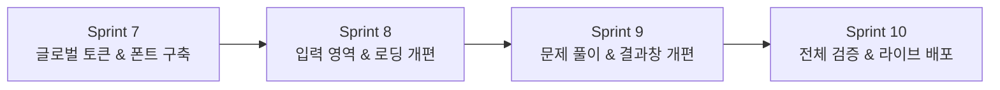

# 🎨 바우하우스 · 네오 브루탈리즘(Bauhaus — Neo-Brutalist) 디자인 개편 계획서

> **기준 문서**: [`desgin.md`](file:///c:/study_zip/desgin.md)  
> **디자인 철학**: "Form Follows Function" (형태는 기능을 따른다)  
> **핵심 키워드**: 대담함(Bold), 직관성(Raw), 고대비(High Contrast), 강렬한 기하학(Geometry), 오프셋 솔리드 섀도우(Offset Shadow)

---

## 1. 디자인 시스템 토큰 정의 (Design Tokens)

### 1.1 컬러 팔레트 (Palette)
- **Background (`#f5f0e8`)**: 따뜻한 미색(Aged Paper), 부드럽고 빈티지한 배경
- **Primary Text & Border (`#1a1a1a`)**: 강렬한 딥 블랙 (텍스트 및 2.5px~3px 솔리드 보더)
- **Accent Yellow (`#ffcc00`)**: 고에너지 하이라이트, 메인 CTA 버튼, 액티브 상태
- **Accent Red (`#e63b2e`)**: 경고, 오답, 삭제, 긴급 알림 배지
- **Accent Blue (`#0055ff`)**: 인터랙티브 요소, 기본개념 배지, 링크
- **Card Surface (`#ffffff`)**: 순백색 또는 미색 블록

### 1.2 타이포그래피 (Typography)
- **Display / Headlines**: `Space Grotesk` (기하학적, 볼드, 3x+ 크기 대비)
- **Body & Korean Text**: `Inter` + `Noto Sans KR` (가독성 최적화)

### 1.3 엘리베이션 & 형태 규칙 (Elevation & Shapes)
- **Border**: 모든 컴포넌트에 `2.5px solid #1a1a1a` 적용
- **Shadow**: 부드러운 블러 그림자 전면 배제 ❌ ➔ **하드 솔리드 오프셋 그림자 (`4px 4px 0px #1a1a1a`)** 적용 ⭕
- **Radius**: 라운딩 전면 제거 (`rounded-none` 또는 최소 2px)
- **Hover/Active 인터랙션**: 클릭 시 `translate(2px, 2px)` 이동하며 오프셋 그림자가 줄어드는 물리적 버튼 촉감

---

## 2. 스프린트 단위 개편 로드맵

| 스프린트 | 개편 대상 | 핵심 산출물 및 작업 내용 |
| :--- | :--- | :--- |
| **Sprint 7** | 글로벌 테마 & 폰트 시스템 | `globals.css`, `layout.tsx` (Space Grotesk 폰트 추가, 네오 브루탈리즘 토큰 적용) |
| **Sprint 8** | 헤더, 입력 영역, 로딩 컴포넌트 | `InputSection` (예시 프리셋, 텍스트창, 문제유형 라디오), `LoadingSection` 브루탈리즘화 |
| **Sprint 9** | 퀴즈 풀이 카드 & 결과 화면 | `QuizSection` (4지선다, 프로그레스바), `ResultSection` (원형/블록 점수판, 오답노트 복사 버튼) |
| **Sprint 10** | 전수 검증, 빌드 & Vercel 배포 | 자동화 테스트(`verify-all.mjs`), 프로덕션 빌드, Vercel 라이브 배포 (`npx vercel --prod`) |

---

## 3. 컴포넌트별 세부 수정 명세

### 3.1 헤더 (Header & Theme)
- 거대한 볼드 헤드라인 (`Space Grotesk`, `text-3xl sm:text-5xl font-black tracking-tight`)
- 기하학적 사각 심볼 배지 (노란색 배경 + 두꺼운 검정 테두리)

### 3.2 입력 영역 (`InputSection`)
- **원클릭 예시 버튼**: 두꺼운 테두리 + 호버 시 색상 반전(Invert) 효과
- **텍스트 입력창**: 두꺼운 검정 테두리 + 하드 섀도우 (`rounded-none shadow-[4px_4px_0px_#1a1a1a]`)
- **문제 유형 선택기**: 사각 카드 형태의 선택 블록 (선택 시 `#ffcc00` 배경 + 4px 오프셋 섀도우)
- **생성 버튼**: 고대비 옐로우(`#ffcc00`) + 블랙 볼드 대문자 + 액티브 클릭 인터랙션

### 3.3 로딩 인디케이터 (`LoadingSection`)
- 회전하는 부드러운 스피너 대신 **기하학적 사각 박스 펄스 애니메이션**과 볼드 타이포그래피

### 3.4 퀴즈 풀이 카드 (`QuizSection`)
- 2.5px 검정 테두리 + `shadow-[4px_4px_0px_#1a1a1a]`
- 문제 번호: 사각 솔리드 블랙 박스 속 흰색 숫자
- 선택지 버튼: 클릭 시 노란색/블랙 하드 반전 선택 상태

### 3.5 채점 결과창 (`ResultSection`)
- 블록형 고대비 점수판 (정답률 대형 폰트 표시)
- 오답 카드: `#e63b2e` 빨간색 포인트 테두리
- 정답 카드: `#ffcc00` 노란색 포인트 테두리
- 오답노트 복사 & 새 퀴즈 만들기 버튼 브루탈리즘 스타일링
