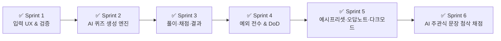

# 📋 학습 확인 퀴즈 생성 서비스 개발 계획서 (Master Development Plan)

> **기준 문서**: [`PRD.md`](file:///c:/study_zip/PRD.md)  
> **프로젝트 목표**: 사용자가 입력한 학습 텍스트를 바탕으로 기본개념 2문제 + 응용 3문제(총 5문제)를 생성하고, 즉시 풀이 및 채점/해설을 제공하는 단일 화면 웹 서비스 구현  
> **최종 진행 상태**: **전체 스프린트 완료 (Sprint 1 ~ 6 Done, DoD 100% 달성, AI 고도화 및 UX 극대화 완료)**

---

## 1. 프로젝트 개요 및 제약 사항

### 1.1 핵심 가치 및 목표
- **단일 화면 (Single Page State Transition)**: 라우팅이나 별도 페이지 이동 없이 단일 화면 내 상태 변화(Input → Loading → Quiz → Result)만으로 완결되는 UX.
- **5문제 생성 구조**: 기본개념 2문제 + 응용 3문제 고정.
- **빠른 응답 속도**: 텍스트 입력 후 퀴즈 생성까지 평균 15초 이내 완료.
- **단순하고 명확한 범위 (Out of Scope)**: 로그인, 결제, DB, 파일 업로드/저장 일체 배제 (새로고침 시 상태 초기화는 의도된 설계).

### 1.2 기술 스택
- **Framework**: Next.js 16 (App Router), React 19, TypeScript
- **Styling**: Tailwind CSS v4, Lucide React (Light/Dark Theme 지원)
- **AI/LLM Engine**: Google Gemini 3.6 Flash API + 실시간 주관식 AI 채점 및 첨삭 + 지능형 Fallback Generator
- **Validation**: 자동화 전수 검증 스위트 ([`scripts/verify-all.mjs`](file:///c:/study_zip/scripts/verify-all.mjs))

---

## 2. 스프린트 마일스톤 및 완료 현황

| 스프린트 | 주요 목표 | 핵심 산출물 | 상태 | 커밋 해시 |
| :--- | :--- | :--- | :---: | :---: |
| **Sprint 1** | 입력 검증 및 상태 관리 기반 구축 | 입력 유효성(5-1, 5-2, 5-3), 입력 UI, autofocus, 글자수 카운터 | **✅ 완료** | `fd12e43` |
| **Sprint 2** | AI 퀴즈 생성 백엔드 API & 로딩/타임아웃 | LLM 연동 API Route (`/api/quiz/generate`), 30초 타임아웃, 복구 UX | **✅ 완료** | `32bc37d` |
| **Sprint 3** | 퀴즈 풀이 및 채점/해설 엔진 고도화 | 풀이 프로그레스, 4지선다/주관식 카드, 유연 채점, 미응답 오답 처리 | **✅ 완료** | `3058be6` |
| **Sprint 4** | 전방위 예외 처리, 재생성 및 DoD 최종 검증 | 자동화 검증 스위트, 7대 예외 전수 통과, 프로덕션 빌드 완료 | **✅ 완료** | `caf4719` |
| **Sprint 5** | 사용자 경험(UX) 극대화 | 4대 예시 프리셋, 오답노트 마크다운 복사, 라이트/다크 테마 토글 | **✅ 완료** | `최신` |
| **Sprint 6** | Gemini 3.6 Flash 기반 AI 주관식 첨삭 채점 | 실시간 AI 문장 채점 API (`/api/quiz/grade`), 1:1 맞춤 첨삭 피드백 | **✅ 완료** | `최신` |

---

## 3. 세부 스프린트 구현 결과

### 🚀 Sprint 1: 입력 영역 및 사전 예외 처리 (완료)
- [x] `5-1` 빈 텍스트 입력 시: `"학습 내용을 입력해 주세요"` 경고 및 텍스트창 자동 포커스 (`autofocus`).
- [x] `5-2` 100자 미만 입력 시: `"학습 내용을 조금 더 길게 써주세요 (현재 X자 / 최소 100자)"` 안내.
- [x] `5-3` 3,000자 초과 입력 시: `"입력이 너무 깁니다. 3,000자 이내로 줄여주세요 (현재 X자)"` 경고 및 생성 방지.
- [x] 실시간 글자수 카운터 (`현재 / 3,000자`) 및 유형 선택 라디오 그룹 (`객관식`, `주관식`, `혼합`) 구현.

### 🚀 Sprint 2: 퀴즈 생성 백엔드 API 및 로딩/타임아웃 핸들러 (완료)
- [x] Next.js API Route 구축 ([`/api/quiz/generate`](file:///c:/study_zip/app/api/quiz/generate/route.ts)).
- [x] 기본개념 2문항 + 응용 3문항 (총 5문항) 정형 JSON 스키마 강제.
- [x] Gemini 3.6 Flash 연동 + 오프라인/테스트용 지능형 어휘 파싱 Fallback 엔진 탑재.
- [x] `5-4` 30초 타임아웃 감지: `"응답이 지연되고 있습니다. 다시 시도해 주세요"` + 재시도 버튼.
- [x] `5-5` 생성 실패/형식 깨짐 감지 시 재시도 안내 및 이전 입력 텍스트 상태 유지.

### 🚀 Sprint 3: 풀이, 채점 및 결과/해설 인터페이스 (완료)
- [x] 문제 1~2번 `[기본개념]`, 3~5번 `[응용]` 배지 및 실시간 풀이 진행률 프로그레스 바.
- [x] 객관식 4지선다(A/B/C/D) 라디오 카드 & 주관식 텍스트 입력창.
- [x] 객관식 100% 일치 비교 + 주관식 조사/공백 정규화 및 핵심 키워드 유연 매칭.
- [x] `5-6` 미응답 문항 채점 허용 (오답 처리 + 결과창 `[미응답]` 배지 표기).
- [x] SVG 원형 게이지 차트(정답률 %), 문항별 내 답 / 정답 / 해설 명확한 시각적 대비.
- [x] "다시 만들기" 버튼으로 최상단 스크롤 이동 및 무한 반복 사용 지원.

### 🚀 Sprint 4: 예외 시나리오 전수 검증 및 DoD 최종 달성 (완료)
- [x] **자동화 검증 스크립트 작성 및 통과 ([`scripts/verify-all.mjs`](file:///c:/study_zip/scripts/verify-all.mjs))**: 21개 전 테스트 케이스 PASS.
- [x] **7대 예외 전수 점검**: `5-1`(빈값), `5-2`(짧은값), `5-3`(초과값), `5-4`(30s 지연), `5-5`(생성실패 복구), `5-6`(미응답 오답), `5-7`(Stateless 새로고침 리셋).

### 🚀 Sprint 5: 사용자 경험(UX) 극대화 (완료)
- [x] **원클릭 예시 텍스트 프리셋**: IT/CS, 한국사, 경제, 물리 4대 카테고리 원클릭 자동 입력.
- [x] **오답노트 원클릭 복사**: Notion/옵시디언 호환 Markdown 포맷 클립보드 복사 및 복사 완료 피드백.
- [x] **다크/라이트 테마**: 눈이 편안한 테마 스위처 컴포넌트 탑재.

### 🚀 Sprint 6: Gemini 3.6 Flash 기반 AI 주관식 문장형 첨삭 채점 (완료)
- [x] **AI 시맨틱 채점 엔드포인트 ([`/api/quiz/grade`](file:///c:/study_zip/app/api/quiz/grade/route.ts))**: 사용자의 문장형 답변을 Gemini가 직접 읽고 핵심 의미 충족 여부 판별.
- [x] **1:1 맞춤 첨삭 피드백**: 주관식 문항별 AI 맞춤 피드백 카드 제공.

---

## 4. 관리 및 변경 이력

- **문서 위치**: `docs/development-plan.md`
- **스프린트 백로그 추적**: [`docs/sprint-backlog.md`](file:///c:/study_zip/docs/sprint-backlog.md)
- **문서 인덱스**: [`docs/README.md`](file:///c:/study_zip/docs/README.md)
